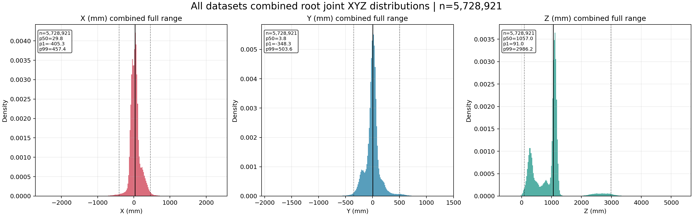
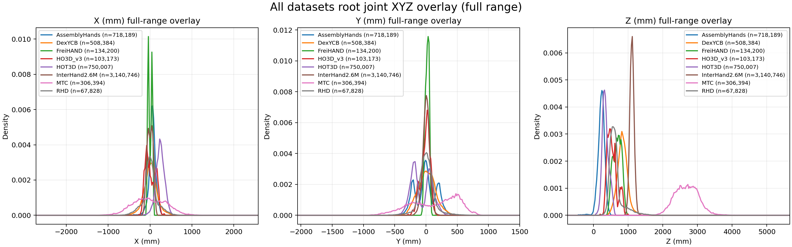
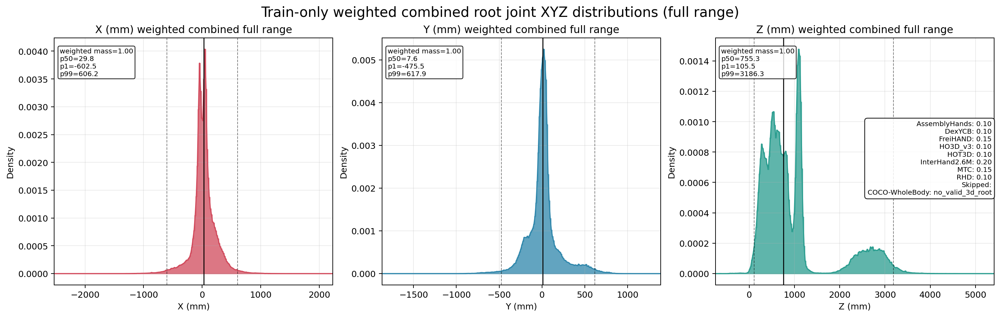

# Root-Z 多峰分布建模对接包

这个文档包用于对接当前手部 3D 模型训练栈，目标不是只告诉实现团队“怎么做”，而是把当前数据分布、问题成因、设计选择和工程落地点一次讲清楚，让团队能够基于相同问题定义去实现，而不是机械复刻一个 head。

当前问题聚焦在：

- 多数据集混训时，`root_z` 的全局分布明显多峰；
- `InterHand2.6M` 样本量极大，且其 `z` 峰值非常集中，会主导单头连续回归器；
- `MTC` 的深度远大于其他数据集；
- `AssemblyHands/HOT3D` 又是另一组近距离峰；
- 在这种情况下，一个共享的单头 `L1/SmoothL1 root_xyz` regressor 很容易学成“峰间平均值”。

本文档给出的 V1 方案是：

1. 只改 `root_z`，改成 `log(z) + bin classification + residual regression`
2. 只改 dataset-level sampler，不在第一阶段引入更复杂的 `z-bin sampling`

当前假设：

- 主干网络：`ViT-L + encoder regressor`
- 输入信息已包含：
  - hand crop
  - bbox
  - intrinsics

因此当前瓶颈主要不在输入信息不足，而在：

- target 参数化不适合多峰分布；
- 训练采样天然偏向大数据集主峰；
- shared regressor 被不平衡分布拖向单一模式。


## 包内容

- `README.md`
- `train_weighted_sampling_weights.json`
- `images/all_datasets_combined_full_range.png`
- `images/all_datasets_overlay_full_range.png`
- `images/train_weighted_combined_full_range.png`
- `images/InterHand2.6M__split_overlay.png`
- `images/MTC__split_overlay.png`
- `images/DexYCB__split_overlay.png`
- `images/AssemblyHands__train__xyz_distribution.png`
- `images/HOT3D__train__xyz_distribution.png`
- `images/RHD__train__xyz_distribution.png`


## 1. 数据分布证据

### 1.1 全体数据的 full-range 总体分布

这张图是所有有效 `root` 样本直接混在一起后的总体 full-range 分布：



对当前问题最关键的是 `Z` 轴：

- 它不是单峰；
- 可以清楚看到近距簇、中距簇、远距簇；
- `2000-3000mm` 一带有明显远距小峰，对应 `MTC`；
- 主峰并不来自“所有数据自然共享的一个连续深度过程”，而是来自多个数据集叠加。

这意味着：

- 把 `root_z` 当作单峰连续变量直接回归，并不符合当前训练数据的统计结构；
- 如果使用共享单头回归器，模型最容易收敛到大峰或峰间平均解。


### 1.2 所有数据集的 full-range 叠图

这张图把所有数据集分别叠在一起：



从 `Z` 轴直接可以读出：

- `AssemblyHands`：非常近，主峰在 `200-300mm`
- `HOT3D`：近距，主峰在 `300-400mm`
- `HO3D_v3 / RHD / FreiHAND / DexYCB`：中距带，但并不完全同分布
- `InterHand2.6M`：`~1100mm`，非常窄且高的强主峰
- `MTC`：`~2500-3000mm` 的远距峰

这进一步说明：

- 当前问题首先是 dataset mixture 问题；
- 不是一条平滑连续 `z` 曲线，而是多个 domain-conditioned 峰叠加；
- `InterHand2.6M` 的高峰会在 batch 统计和回归梯度上天然占优。


### 1.3 按建议采样权重加权后的 train-only full-range 总体分布

这张图只使用 `train` split，并按当前建议的 dataset-level sampling weights 进行加权：



从这张图可以看出两件事：

1. 即便做了 dataset-level reweight，`z` 依然不是单峰问题；
2. 但远距峰和近距峰不会再被 `InterHand2.6M` 完全淹没。

这正是我们建议第一阶段先做 dataset reweight、再改 `root_z` 头的原因：

- 采样先解决“大峰压制小峰”的优化问题；
- `log(z) + multibin` 再解决“单头回归不适合多峰 target”的表达问题。


## 2. 当前 train split 的关键统计

以下是当前 train split 的 `T=1` 统计。这里 `num_frames` 就是 `T=1, stride=1` 下的样本数。

| Dataset | Train Split | `T=1`样本数 | 有效3D root帧数 | `z_p50` (mm) | `z_p95` (mm) | 备注 |
|---|---:|---:|---:|---:|---:|---|
| AssemblyHands | `AssemblyHands/train` | 718,189 | 718,189 | 231.2 | 366.7 | 近距、`Y` 多峰明显 |
| COCO-WholeBody | `COCO-WholeBody/train` | 78,799 | 0 | - | - | 2D-only，不参与 `root_z` 监督 |
| DexYCB | `DexYCB/s1/train` | 356,600 | 356,600 | 827.2 | 1078.9 | 中距，分布较稳 |
| FreiHAND | `FreiHAND/train` | 130,240 | 130,240 | 692.4 | 869.1 | 中距偏近 |
| HO3D_v3 | `HO3D_v3/train` | 83,091 | 83,091 | 503.5 | 824.3 | 中近距，多峰/肩部明显 |
| HOT3D | `HOT3D/train` | 750,007 | 750,007 | 334.1 | 524.2 | 近距，`X/Y` 偏置强 |
| InterHand2.6M | `InterHand2.6M/train` | 1,636,144 | 1,636,144 | 1097.5 | 1189.2 | 极强单峰，天然主导训练 |
| MTC | `MTC/train` | 240,096 | 240,096 | 2689.3 | 3251.6 | 远距，跨度最大 |
| RHD | `RHD/train` | 63,742 | 63,742 | 589.1 | 1072.0 | 合成数据风格，长尾明显 |

这张表里最重要的信息不是均值，而是：

- `InterHand2.6M/train` 样本最多，且 `z` 极度集中；
- `MTC/train` 虽然样本少，但深度极远；
- `AssemblyHands/HOT3D` 形成近距离簇；
- `DexYCB/FreiHAND/HO3D/RHD` 位于中距离带；
- `COCO-WholeBody/train` 采样时可以存在，但不应该参与 `root_z` loss。


## 3. 读图后的问题诊断

### 3.1 为什么单头 `root_xyz` 回归容易失败

如果当前 head 直接回归：

```text
root_x, root_y, root_z
```

那么优化器面对的是一个明显多峰的 `z` target。

这时会出现三个问题：

1. **大峰吸附**
   - `InterHand2.6M` 样本量大、峰高且窄；
   - 共享回归器会优先学会把大量样本压向这一个峰。

2. **峰间平均**
   - 对近距和远距样本，单头连续回归很容易输出一个“对整体 L1 损失还不错”的中间值；
   - 这个值对任何具体 domain 都不理想。

3. **绝对尺度与相对误差不匹配**
   - `300mm -> 350mm` 的 50mm 误差和 `2700mm -> 2750mm` 的 50mm 误差，语义上并不等价；
   - 直接在原始毫米尺度上回归，不利于统一建模。


### 3.2 为什么当前输入已经足够

你们当前输入已经包含：

- crop
- bbox
- intrinsics

这些信息本身已经足以提供深度判别线索：

- bbox 大小和 hand crop 视觉尺度直接相关；
- intrinsics 决定像素尺度和真实尺度之间的映射；
- crop 视觉内容还能提供透视与手部大小线索。

所以当前不是“模型看不出来”，而是“训练目标定义得太粗，优化时被不平衡分布拖偏了”。


### 3.3 为什么 first step 不是直接上 `z-bin sampler`

可以做 `z-bin sampler`，但不建议第一步就做，原因是：

- 当前最大失衡首先来自 dataset 本身，而不是同一 dataset 内部的 `z` 长尾；
- 一上来同时改：
  - sampler
  - target
  - head
  - z-bin 采样
  会让问题定位困难；
- dataset-level reweight 是更稳的第一步，可以先验证模型是不是单纯被 `InterHand2.6M` 主导了。


## 4. 为什么采用 `log(z) + bin classification + residual`

### 4.1 为什么是 `log(z)`，不是直接回归 `z`

`log(z)` 的好处有三个：

1. **压缩尺度跨度**
   - `MTC` 的远距尾部不会在数值尺度上压倒近距样本；
   - 近距和远距能落到更可比较的数值区间。

2. **更接近相对误差**
   - `log(z)` 上的固定偏差更接近“百分比误差”；
   - 对多数据集混训更合理。

3. **更适合做等宽 bins**
   - 在原始毫米空间里做等宽 bin 很浪费；
   - 在 `log(z)` 空间里，bin 的语义更均衡。


### 4.2 为什么是先分类再回归

如果直接让一个头回归 `log(z)`，多峰问题仍然存在。  
而分成：

- coarse bin classification
- bin 内 residual regression

相当于把任务拆成两步：

1. 先判断这个样本大致属于哪一段深度带；
2. 再在这一小段内做连续细化。

这样做的收益是：

- 分类分支负责解决多峰问题；
- residual 分支只处理局部连续细节；
- 优化难度明显低于“一个头直接对所有峰做连续拟合”。


### 4.3 为什么第一版用固定 bins

固定 bins 的原因不是它理论最优，而是它工程上最稳：

- 实现简单；
- 容易 debug；
- 可以直接从当前统计图反推出覆盖范围；
- 不会因为自适应 bins 的动态漂移引入额外不确定性。

当前推荐：

- `z_min = 64mm`
- `z_max = 4096mm`
- `K = 8`

对应边界：

- `64`
- `108`
- `181`
- `304`
- `512`
- `861`
- `1448`
- `2437`
- `4096`

这组 bin 能把：

- `AssemblyHands/HOT3D` 的近距峰
- `DexYCB/FreiHAND/HO3D/RHD` 的中距峰
- `InterHand2.6M` 的中远距窄峰
- `MTC` 的远距峰

都覆盖进去。


## 5. 建议的 V1 训练方案

### 5.1 Root-Z target

定义：

```text
z_mm = joint_cam[root_idx, 2]
t = log(z_mm)
t_min = log(64)
t_max = log(4096)
Δ = (t_max - t_min) / K
b = clip(floor((t - t_min) / Δ), 0, K-1)
c_b = t_min + (b + 0.5) * Δ
r = (t - c_b) / Δ
```

其中：

- `b` 是 bin id
- `r` 是该 bin 内 residual
- 理论上 `r ∈ [-0.5, 0.5]`


### 5.2 有效样本定义

`root_z` loss 只在以下条件满足时计算：

- `joint_3d_valid[root_idx] > 0.5`
- `z_mm > 0`
- `z_mm` 在有效深度范围内，或先 clamp 后再编码

这里必须强调一点：

- 当前统计图里某些数据集的 `full-range z` 存在极少量 `z <= 0` 尾部；
- 这类样本不能直接拿来做 `log(z)` 监督；
- 必须显式 mask 掉或单独处理。


### 5.3 Head 输入建议

`root_z_head` 输入建议由两部分拼接：

1. `f_vis`
   - ViT-L 的 pooled visual feature

2. `f_geo`
   - 至少包含：

```text
log(bbox_w)
log(bbox_h)
bbox_cx / image_w
bbox_cy / image_h
log(fx)
log(fy)
cx / image_w
cy / image_h
```

可选项：

- `data_source embedding`

关于 `data_source embedding` 的建议：

- 如果目标是“先把已知数据集上的训练/验证做稳”，可以开；
- 如果目标是尽量避免模型过度依赖 domain id，则第一版可以关掉；
- 建议把它做成 config 开关。


### 5.4 Head 输出

建议输出：

- `z_cls_logits: [B, K]`
- `z_residuals: [B, K]`

训练时：

- 对 `z_cls_logits` 做 bin 分类；
- 对 `z_residuals` 只取 GT bin 对应的 residual。


### 5.5 Loss

建议：

```text
L_root_z = L_cls + λ_res * L_res
```

其中：

- `L_cls`：class-balanced CE
- `L_res`：GT bin 上的 `SmoothL1`
- `λ_res = 1.0`

bin 权重建议：

```text
w_bin = 1 / sqrt(freq_bin + ε)
```

第一版不建议直接上太强的 inverse-frequency。


### 5.6 推理恢复

推理时：

```text
b_hat = argmax(z_cls_logits)
r_hat = clamp(z_residuals[b_hat], -0.5, 0.5)
t_hat = c_{b_hat} + r_hat * Δ
z_hat = exp(t_hat)
```

这里对 residual 做 clamp 的原因是：

- 避免 residual 分支在推理时跑出 bin 支持区间太远；
- 降低训练早期或分布外样本带来的爆炸性误差。


## 6. 建议的 train sampler

第一阶段只做 dataset-level reweighting。

建议权重：

| Dataset | Weight | 设计意图 |
|---|---:|---|
| AssemblyHands | 0.10 | 保留近距簇 |
| COCO-WholeBody | 0.10 | 保留 2D 监督，但不参与 root_z |
| DexYCB | 0.10 | 保留中距真实采集数据 |
| FreiHAND | 0.15 | 提高中近距稳定样本占比 |
| HO3D_v3 | 0.10 | 保留中近距 object-interaction 数据 |
| HOT3D | 0.10 | 保留近距但明显偏置的 egocentric 数据 |
| InterHand2.6M | 0.20 | 明显降权，但仍保留最大单域监督量 |
| MTC | 0.15 | 远距峰不能丢，需显式抬高 |
| RHD | 0.10 | 保留合成域对长尾和姿态覆盖的贡献 |

当前实际用于可视化的权重文件见：

- `train_weighted_sampling_weights.json`

说明：

- `COCO-WholeBody` 在这个权重表里保留，是因为它仍可能用于 2D 或其他 supervision；
- 但在 3D root 分布统计里它没有有效样本，因此不会影响 `root_z` 统计图。


## 7. 为什么这个 sampler 是合理的

这套权重不是拍脑袋，而是由两件事共同决定：

1. 当前 `train` 的 `T=1` 样本量
2. 当前 `z` 的 full-range 分布峰值位置

具体来说：

- `InterHand2.6M`：样本量和主峰都太强，必须降权；
- `MTC`：远距峰稀有但重要，必须抬权；
- `AssemblyHands/HOT3D`：近距段必须保留，否则模型容易只会预测中远距；
- `DexYCB/FreiHAND/HO3D/RHD`：构成中距离带和更宽的 domain coverage；
- `COCO-WholeBody`：继续保留在全局训练采样里，但 root-z loss 要 mask。


## 8. 为什么第一阶段不直接改 `root_xy`

理论上，最干净的 absolute root 表达是：

- 预测 `root_uv`
- 预测 `root_z`
- 再通过 pinhole 几何恢复 `root_x/root_y`

但第一阶段不建议同时做这个改动，原因是：

- 你们当前的主问题已经集中在 `root_z`
- 同时改 `root_xy` 表达会增大变量数量
- 不利于判断收益到底来自：
  - sampler
  - log-depth multibin
  - 还是坐标表达重构

因此建议顺序是：

1. 先改 `root_z`
2. 如果 `root_z` 问题解决后，`root_xy` 仍表现不稳定，再升级到 `uv + z`


## 9. 最小实现伪代码

### 9.1 Target 构造

```python
import math
import torch

ROOT_IDX = 0
Z_MIN_MM = 64.0
Z_MAX_MM = 4096.0
NUM_BINS = 8

t_min = math.log(Z_MIN_MM)
t_max = math.log(Z_MAX_MM)
delta = (t_max - t_min) / NUM_BINS

root_z = joint_cam[:, ROOT_IDX, 2]  # [B]
valid = joint_3d_valid[:, ROOT_IDX] > 0.5
valid = valid & (root_z > 0)

root_z_clamped = root_z.clamp(min=Z_MIN_MM, max=Z_MAX_MM)
t = torch.log(root_z_clamped)
bin_idx = torch.floor((t - t_min) / delta).long().clamp(0, NUM_BINS - 1)
bin_center = t_min + (bin_idx.float() + 0.5) * delta
residual = (t - bin_center) / delta
```

### 9.2 Forward 和 Loss

```python
z_cls_logits, z_residuals = root_z_head(features, geom_features)

loss_cls = ce_loss(z_cls_logits[valid], bin_idx[valid], weight=bin_weights)
pred_residual = z_residuals[valid, bin_idx[valid]]
loss_res = smooth_l1(pred_residual, residual[valid])
loss_root_z = loss_cls + lambda_res * loss_res
```

### 9.3 Decode

```python
pred_bin = z_cls_logits.argmax(dim=-1)
pred_residual = z_residuals.gather(1, pred_bin[:, None]).squeeze(1).clamp(-0.5, 0.5)
pred_center = t_min + (pred_bin.float() + 0.5) * delta
pred_logz = pred_center + pred_residual * delta
pred_z_mm = pred_logz.exp()
```


## 10. 常见失败模式和定位方法

### 10.1 预测仍然塌到 `InterHand2.6M` 主峰

现象：

- `root_z` 预测直方图仍集中在 `~1100mm`
- 近距和远距样本都往中间吸

优先排查：

1. sampler 是否真的按配置生效
2. `root_z` loss 是否只在有效 3D root 上归一化
3. bin classification 是否几乎总选同一个 bin


### 10.2 分类分支收敛，residual 分支不收敛

现象：

- coarse bin 正确
- 但 bin 内误差大，深度抖动明显

优先排查：

1. residual 是否只监督 GT bin
2. residual 的 target 范围是否正确在 `[-0.5, 0.5]`
3. residual 输出是否需要更强的正则或 clamp


### 10.3 边界 bin 预测不稳定

现象：

- 极近或极远样本容易跳 bin

优先排查：

1. `z_min / z_max` 是否覆盖当前训练集
2. 超界样本比例是否过高
3. 是否需要把 `64-4096` 再向外略扩一点


### 10.4 单位错误

现象：

- loss 爆炸
- 预测深度离谱
- `log(z)` 出现异常值

优先排查：

1. 当前 `joint_cam` 单位是否确实为 `mm`
2. `bbox/intrinsics` 是否和图像坐标口径一致
3. 是否有 `m` 和 `mm` 混用


## 11. 训练日志里必须看什么

至少记录以下项：

- 每 dataset 的样本占比
- 每 dataset 的 `root_z` MAE / RMSE
- `z_bin` confusion matrix
- 预测 `z_bin` 的直方图
- 预测 `root_z` 的整体分布图
- 预测 `root_z` 的分 dataset 分布图

不要只看全局平均 loss。


## 12. 必做 sanity check

### 12.1 小子集过拟合

拿少量训练样本：

- 关闭大部分增强
- 只训几千步
- 看 `root_z` 是否能明显拟合

如果过拟合都失败，优先排查 target 和 loss，而不是继续调 sampler。


### 12.2 预测分布对齐检查

训练若干 epoch 后，至少把预测的 `root_z` 画成 full-range 分布图，和当前统计图对比：

- 是否还只剩一个主峰；
- 远距峰是否被完全压扁；
- 近距样本是否被吸向中距离。


## 13. 建议的 ablation 顺序

为了避免多变量一起变化，建议严格按下面顺序：

1. baseline：原始 `root_z` 回归 + 原始 sampler
2. baseline + dataset sampler
3. `log(z) multibin` + 原始 sampler
4. `log(z) multibin` + dataset sampler
5. 如果还不够，再做：
   - `uv + z`
   - `z-bin sampling`
   - adaptive bins

这个顺序能帮助判断收益到底来自哪里。


## 14. 一句话给实现团队

当前不是“模型看不懂深度”，而是“训练目标和采样方式没有尊重当前数据的多峰分布”。  
V1 的目标不是一步到位做成最终最优，而是先把 `root_z` 从“单峰连续回归问题”改写成“多模态分类 + 局部残差问题”，并用 dataset reweight 先把 `InterHand2.6M` 的主峰压制住。  
如果这一步有效，再决定是否继续升级到 `uv + z` 或更细的 `z-bin sampler`。
